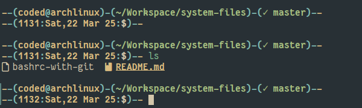
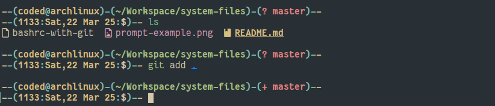
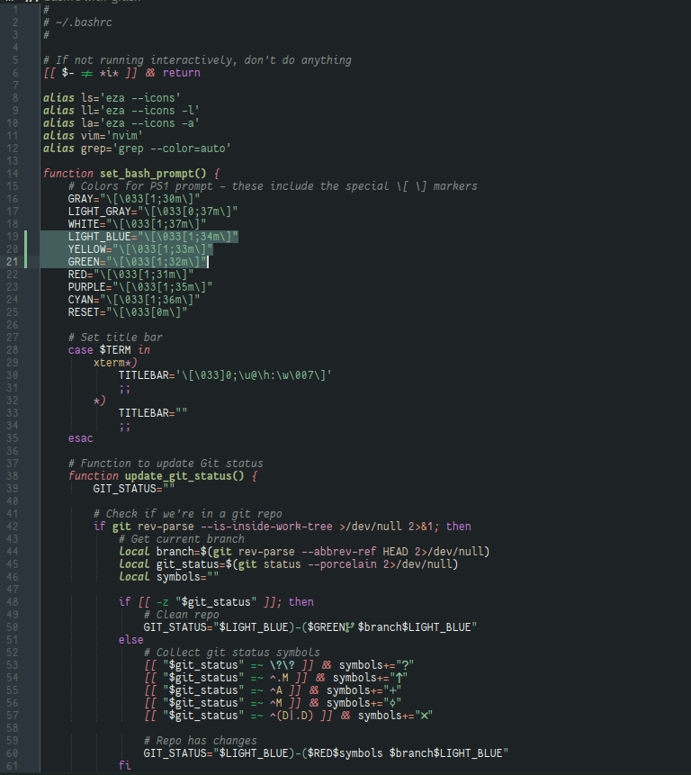

## REQUIREMENTS

- Install [eza](https://github.com/eza-community/eza)
- Install [bash-line editor](https://github.com/akinomyoga/ble.sh)
- Install Neovim

### PUT THE bashrc in ~ with name .bashrc

```bash
git clone https://github.com/TheCodedShader/system-files.git
cd system-files/

#Make backup of existing bashrc
cp ~/.bashrc ~/.bashrc.bak
cp bashrc-with-git ~/.bashrc
```


This prompt is based on the [Tonka2 bash Prompt](https://gilesorr.com/bashprompt/prompts/tonka2.html)

### Prompt example 1


### Prompt example 2



## Everforest style color scheme for Kate text editor

Based on the [Everforest Color Palette](https://github.com/sainnhe/everforest/blob/master/palette.md)



